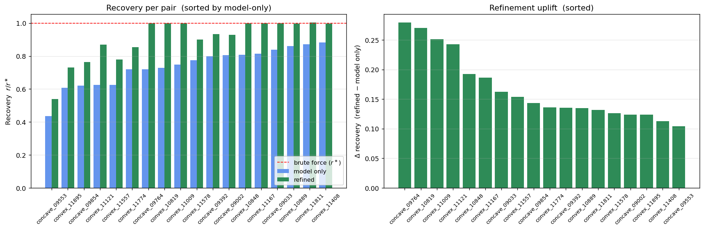

# TurmpfNesting — Placement Network

> **Author:** August Dua · MSc Math, TUM (Candidate)

A learned placement function that, given a free-space polygon `F` and a part polygon `P`, returns a placement `(θ, x, y)` that maximizes a Shapely-defined reward. Trained on 22 000 (convex–convex + concave-fs / convex-part) pairs. Reaches **0.73 mean val recovery** with a single 3.13 M-parameter U-Net and one forward pass per rotation, pushed to near-1.0 with a small Shapely refinement step.

See [METHODOLOGY.md](METHODOLOGY.md) for the full derivation, and [instructions.md](instructions.md) for step-by-step setup, training, and troubleshooting.

## Highlights

- **Single 3.13 M-parameter U-Net** (`_SmallUNet`), 2-channel input (`fs_mask`, `rotated_part_mask`).
- **One forward pass per rotation** — 36 rotations × 128×128 grid covers the full discrete action space (589 824 candidates).
- **0.73 mean val recovery** model-only; **≈ 1.0** with ±10 px / ±2 θ-bin Shapely refinement (2 205 Shapely calls, ≈ 165 ms / pair on CPU).
- **CPU-friendly inference** — full forward + refine in well under a second per pair.
- **~$4** of Modal compute to regenerate the 10 k concave-pair heatmap corpus (≈ 9 min wall on 200 containers × 8 cores).

## Architecture (one paragraph)

Per-(pair, θ) U-Net with 2-channel input (`fs_mask`, `rotated_part_mask`), both `128×128`. Output is a `128×128` per-pixel reward logit map for that rotation. At inference: 36 forward passes (one per `θ ∈ {0, 10, …, 350}°`), argmax over the flat `(36, 128, 128)` volume → predicted `(θ̂, x̂, ŷ)`. Optional bounded Shapely refinement (`±10` px × `±2` θ-bins = 2 205 Shapely calls, ≈ 165 ms) closes the gap to the brute-force optimum.

## Quickstart

```bash
git clone https://github.com/augustdua/TurmpfNesting.git
cd TurmpfNesting

# pip:
pip install -r requirements.txt
# or conda:
conda env create -f environment.yml && conda activate placement-net

# Verify the geometry primitives:
python -m tests.test_geometry

# Self-contained inference demo (no external data needed):
python -m scripts.demo

# Multi-page LaTeX visualization report (requires pdflatex):
python -m scripts.generate_placement_report
```

For the full step-by-step setup (CUDA/CPU PyTorch, Modal training, troubleshooting, data files), see **[instructions.md](instructions.md)**.

## Use it in five lines

```python
from shapely.wkt import loads as wkt_loads
from src.inference.placement import PlacementModel

pm = PlacementModel(
    ckpt="checkpoints/perthet_combined/final.pt",
    device="cuda",      # or "cpu"
)
theta, x, y, reward = pm.place(
    wkt_loads(fs_wkt),
    wkt_loads(part_wkt),
    refine_pixels=10,
    refine_thetas=2,
)
```

Both polygons must lie in `[-1, 1]²`. See `scripts/demo.py::normalize_to_unit` for a one-liner.

## Results

Mean recovery `r / r*` on the held-out 2 200-pair validation set (1 200 convex + 1 000 concave):

| Configuration | Val recovery (model only) | Val recovery (refined) |
|---|---:|---:|
| Hard label, hierarchical (tile + cell) | 0.04 | — |
| Soft label, hierarchical | 0.43 | — |
| Soft label, hierarchical (tile-only) | 0.32 | — |
| **Per-(pair, θ) U-Net — convex-only (N = 10 800)** | **0.72** | ≈ 1.0 |
| **Per-(pair, θ) U-Net — combined (N = 19 800)** | **0.73** | ≈ 1.0 |

See METHODOLOGY.md §Results for the full picture and the figures in the LaTeX report.

## Visualization



The full multi-page PDF report — methodology + 12 convex + 6 concave worked examples + summary — is at **[visualizations/report/placement_pipeline_report.pdf](visualizations/report/placement_pipeline_report.pdf)**. Each example page shows the predicted reward heatmap, the brute-force ground-truth heatmap, the model-only placement, the refined placement, and the brute-force placement side by side, with per-pair Shapely-call counts and timings.

Rebuild it with `python -m scripts.generate_placement_report` (needs `pdflatex` and the data pkls — see [instructions.md](instructions.md) §5).

## What's here

| Concern | File |
|---|---|
| Model | `src/models/neural_bo_policy.py` (`_SmallUNet`) |
| Inference (forward + Shapely refinement) | `src/inference/placement.py` (`PlacementModel`) |
| IFP (handles concave free-space) | `src/geometry/ifp.py` (`compute_ifp_exact`) |
| Reward function | `src/geometry/rewards.py` (`compute_reward_exp`) |
| Zero-data inference demo | `scripts/demo.py` |
| Validation smoke test | `scripts/smoke_refine.py` |
| Training | `scripts/train_perthet.py` |
| Modal training entrypoint | `modal_train_perthet.py` |
| Concave heatmap precompute (Modal) | `modal_concave_precompute.py` |
| Combined-corpus build (Modal) | `modal_build_combined.py` |
| PDF report generator | `scripts/generate_placement_report.py` |
| Step-by-step setup + commands | [instructions.md](instructions.md) |

## Pre-trained checkpoint

`checkpoints/perthet_combined/final.pt` — 3.13 M-parameter U-Net trained on the combined 22 k-pair corpus (10 800 convex + 9 000 concave-fs train, 1 200 + 1 000 val).

## Reproducing the corpus and retraining

The full 22 k-pair corpus is not committed (the heatmap pkls are 14+ GB). The Modal entrypoints regenerate them end-to-end:

1. `modal_concave_precompute.py` — exhaustive Shapely reward heatmaps for the 10 k concave-fs / convex-part pairs. **Real-world measured cost: ~$4** for 10 000 pairs (200 containers × 8 cores, ≈ 9 min wall, ≈ 86 core-hours at Modal's $0.0473/core/hr).
2. `modal_build_combined.py` — combines convex + concave into the unified training pkl.
3. `modal_train_perthet.py` — trains the U-Net (≈ 30 min on A100-80GB, batch 256, cosine LR 3e-4 → 0, 8 000 steps).

Two seed pkls (`bc_snapshot_raster128.pkl`, `bo_train_pool_10k.pkl`, ~1.2 GB combined) are required as input and are **not** in the repo. See [instructions.md](instructions.md) §6 for the upload + run commands.

## License

TBD.
